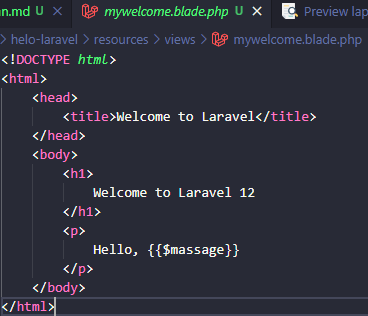
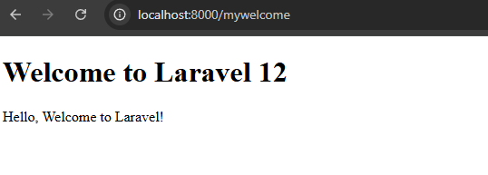
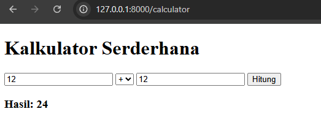
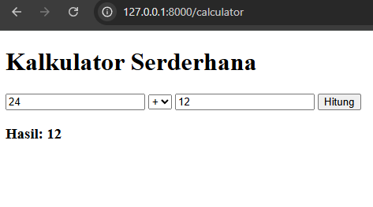
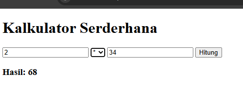
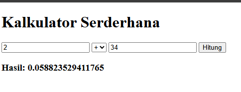
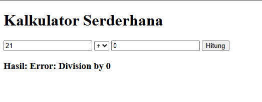

# Laporan Modul 2: Laravel Fundamentasl
**Mata Kuliah:** Workshop Web Lanjut   
**Nama:** Faizul Abrar  
**NIM:** 2024573010103  
**Kelas:** TI 2C  

---

## Abstrak 
Praktikum ini bertujuan untuk memahami konsep dasar Laravel, khususnya penggunaan Routing, Controller, View (Blade), Request dan Response dalam arsitektur MVC. Melalui praktikum ini dibuat dua aplikasi sederhana: Welcome Page untuk mengenal alur MVC dan Calculator untuk memahami alur input, validasi, dan output.
---

## 1. Dasar Teori
- Apa itu MVC (Model, View, Controller).
Pola desain untuk memisahkan logika aplikasi (Model), pengendali alur (Controller), dan tampilan (View).

- Konsep Routing di Laravel.
Routing memetakan URI ke aksi controller atau closure. Route di Laravel didefinisikan di file routes/web.php untuk permintaan web dan di routes/api.php untuk route API.

- Fungsi Middleware.
Lapisan perantara yang memproses request sebelum diteruskan ke aplikasi (misalnya autentikasi).

- Bagaimana cara Laravel menangani Request dan Response.
Laravel menangani request dengan meneruskannya terlebih dahulu melalui middleware, kemudian mencocokkan URL dan metode HTTP ke route yang sudah didefinisikan.

- Peran Controller dan View.
Controller berperan mengolah logika aplikasi dan menghubungkan request dengan data, sedangkan View berperan menampilkan hasil olahan tersebut kepada pengguna melalui Blade.

- Fungsi Blade Templating Engine.
untuk mempermudah pembuatan tampilan di Laravel dengan sintaks yang sederhana. Blade memungkinkan penggunaan variabel, kontrol alur seperti perulangan dan kondisi, serta mendukung pewarisan template, sehingga kode tampilan lebih rapi dan mudah dipelihara.
---

## 2. Langkah-Langkah Praktikum
Tuliskan langkah-langkah yang sudah dilakukan, sertakan potongan kode dan screenshot hasil.

2.1 Praktikum 1 – Route, Controller, dan Blade View

- Tambahkan route pada routes/web.php.

```route
use Illuminate\Support\Facades\Route;
use App\Http\Controllers\WelcomeController;


 Route::get('/', function () {
     return view('welcome');
});
Route ::get('/mywelcome', [WelcomeController::class, 'show']);
```

- Buat controller WelcomeController.
```welcome
php artisan make:controller WelcomeController
```
- Buat view mywelcome.blade.php.
()

- Jalankan aplikasi dan tunjukkan hasil di browser.
Screenshot Hasil:
()

2.2 Praktikum 2 – Membuat Aplikasi Sederhana "Calculator"

- Tambahkan route untuk kalkulator.
```calroute
<?php

use Illuminate\Support\Facades\Route;
use App\Http\Controllers\CalculatorController;

//Route::get('/', function () {
    //return view('welcome');
//});

Route ::get('/calculator', [CalculatorController::class, 'index']);
Route ::post('/calculator', [CalculatorController::class, 'calculate'])->name('calculator.calculate');
```

- Buat controller CalculatorController.
```calcol
php artisan make:controller CalculatorController
```
- Tambahkan view calculator.blade.php.
```viewcal
<!DOCTYPE html>
<html>
<head>
    <title>Laravel Calculator</title>
</head>
<body>
    <h1>Kalkulator Serderhana</h1>

    @if ($errors->any())
        <div style="color: red;">
            <ul>
                @foreach ($errors->all() as $error)
                    <li>{{ $error }}</li>
                @endforeach
            </ul>
        </div>
    @endif

    <form method="POST" action="{{ route('calculator.calculate') }}">
        @csrf
        <input type="number" name="number1" value="{{ old('number1', $number1 ?? '') }}" placeholder="Angka Pertama" required>

        <select name="operator" require>
            <option value="add" {{ ($operator ?? '') }} == 'add' ? 'selected' : '' }}>+</option>
            <option value="sub" {{ ($operator ?? '') }} == 'sub' ? 'selected' : '' }}>-</option>
            <option value="mul" {{ ($operator ?? '') }} == 'mul' ? 'selected' : '' }}>*</option>
            <option value="div" {{ ($operator ?? '') }} == 'div' ? 'selected' : '' }}>/</option>
        </select>   

        <input type="number" name="number2" value="{{ old('number2', $number2 ?? '' ) }}" placeholder="Angka Kedua" required>
        <button type="submit">Hitung</button>
    </form>

    @isset($result)
        <h3>Hasil: {{ $result }}</h3>
    @endisset    
</body>
</html>
```
- Jalankan aplikasi dan coba dengan beberapa input berbeda.
Screenshot Hasil:
-Pertambahan
()
-Pengurangan
()
-Perkalian
()
-Pembagian
()

---

## 3. Hasil dan Pembahasan
Jelaskan apa hasil dari praktikum yang dilakukan.
- Apakah aplikasi berjalan sesuai harapan?
Ya, aplikasi berjalan sesuai harapan. Pada praktikum 1 halaman welcome berhasil tampil, sedangkan pada praktikum 2 kalkulator dapat melakukan operasi hitung sederhana.

- Apa yang terjadi jika ada input yang salah (misalnya pembagian dengan 0)?
Jika ada input yang salah, misalnya pembagian dengan nol, aplikasi menampilkan pesan error sesuai dengan aturan validasi yang dibuat.
()

- Bagaimana validasi input bekerja di Laravel?
Validasi input di Laravel memastikan data yang dikirim sesuai dengan aturan yang ditentukan sebelum diproses lebih lanjut. Jika tidak sesuai, Laravel akan mengembalikan pesan error.

- Apa peran masing-masing komponen (Route, Controller, View) dalam program yang dibuat?
Route berfungsi menghubungkan URL dengan controller. Controller bertugas memproses logika dan data. View menampilkan hasil yang diberikan controller kepada pengguna.

---

## 4. Kesimpulan

Praktikum ini menunjukkan bagaimana Laravel menerapkan arsitektur MVC. Dengan membuat aplikasi sederhana, mahasiswa dapat memahami peran Route, Controller, dan View. Selain itu, penggunaan Blade mempermudah pembuatan tampilan dinamis dan validasi input membantu menjaga keandalan aplikasi.

---

## 5. Referensi
Dokumentasi Laravel — https://laravel.com/docs

Modul 2: Laravel Fundamentals (HackMD) — https://hackmd.io/@mohdrzu/B1zwKEK5xe

---
